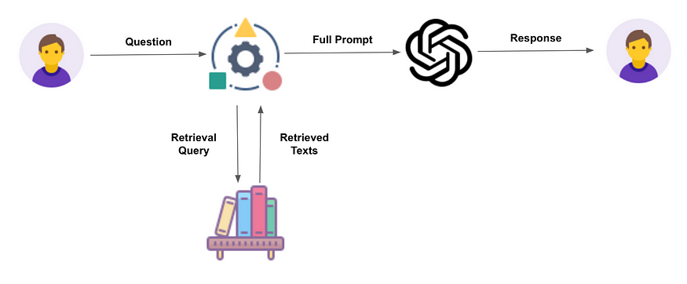

# WiNG Hacks Workshop

Creating our own RAG chat-bot with LangChain and HuggingFace. Check out the demo [here](https://youtube.com/shorts/KNcCWLvu5uk?si=1cwHxrw-d81-m9jz).

## Running it Locally

[Download](https://nodejs.org/en/download) the latest stable version of Node.js if you don't have it
installed yet

### Starting the frontend

1. From the `frontend/` directory, run `npm install` to install the dependencies

2. Run `npm run dev` to run the front-end locally. You can visit 
[http://localhost:5173](http://localhost:5173) to view the frontend now.

### Starting the backend

1. In another terminal, from the `backend/` directory, create a virtual environment by running `python -m venv venv`

2. Enter the virtual environment
 - On Mac/Unix systems: `source venv/bin/activate`
 - On Powershell: `venv\Scripts\Activate.ps1`
 - on cmd.exe: `venv\Scripts\activate.bat`

3. Install the dependencies: `pip install -r requirements.txt`

3. Set the PYTHONPATH variable
- On Mac/Unix based systems, run `export PYTHONPATH=src/`
- On Windows, run `setx PYTHONPATH "src/"`

5. Run the backend in two ways
- `python src/main.py` If you run it with this command, then you must restart the server to reflect changes made in the backend
- `uvicorn src.main:app --host 0.0.0.0 --port 8000 --reload` This should automatically refresh when changes are made

## Running it on Docker

1. Please [download and install docker](https://www.docker.com/products/docker-desktop/) then
clone this repository.

2. Create a [HuggingFace account](https://huggingface.co/login)

3. Create [an api token](https://huggingface.co/settings/tokens) on HuggingFace and copy the key

4. Create a `.env` file in the the `/backend` directory of the project and add the following:
```bash
HF_API_KEY=<Your HuggingFace API Key>
```
where `<Your HuggingFace API Key>` is your HuggingFace API key.

5. If you are on a Mac/Unix system run:

```bash
sudo docker-compose up --build
```

If you are on Windows, you may need to run Powershell as an administrator and run:

```bash
docker-compose up --build
```

## What is RAG (Retrieval Augmented Generation)?

**Definition taken from [Nvidia](https://blogs.nvidia.com/blog/what-is-retrieval-augmented-generation/)**: Retrieval-augmented generation (RAG) is a technique for enhancing 
the accuracy and reliability of generative AI models with facts fetched from external sources.

For example, If I had a database of shows I watched over the past 5 years and I asked
a chatbot using RAG to tell me what shows I binged in March 2023, the chatbot might
tell me that I watched "Business Proposal", "Twenty-Five Twenty-One", and "Family Guy" during 
that time.

Here is a diagram I took from [some LinkedIn post](https://www.linkedin.com/pulse/what-retrieval-augmented-generation-grow-right/):



## What is LangChain 🦜

**Definition taken from [LangChain](https://langchain.com/)**: LangChain gives developers a framework to construct LLM‑powered apps easily.

LangChain is a framework I'm [somewhat familiar with](https://twitter.com/LangChainAI/status/1686763366696787968). It allows you to develop a variety of applications with 
language models like make chatbots, work with agents, chain tools, and more.

We will be using it to parse documents, but you can get a lot more creative with it!

## What is HuggingFace 🤗

**Definition from [Wikipedia](https://en.wikipedia.org/wiki/Hugging_Face)**:
Hugging Face, Inc. is an French-American company based in New York City that develops computer tools for building applications using machine learning. It is most notable for its transformers library built for natural language processing applications and its platform that allows users to share machine learning models and datasets and showcase their work.

HuggingFace hosts a variety of models that you can use for your projects. We will be using
a few of the hosted models to create our RAG chatbot.
